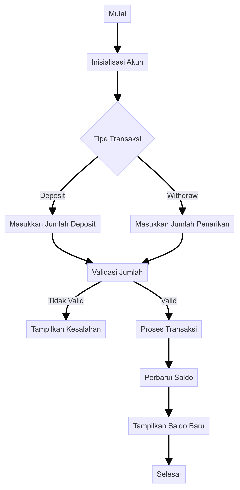

# Pengelola Saldo Bank

## Flowchart


```mermaid
flowchart TD
    A[Mulai] --> B[Inisialisasi Rekening]
    B --> C{Jenis Transaksi}
    C -->|Deposit| D[Masukkan Jumlah Deposit]
    C -->|Withdraw| E[Masukkan Jumlah Penarikan]
    D --> F[Validasi Jumlah]
    E --> F[Validasi Jumlah]
    F -->|Tidak Valid| G[Tampilkan Error]
    F -->|Valid| H[Proses Transaksi]
    H --> I[Perbarui Saldo]
    I --> J[Tampilkan Saldo Baru]
    J --> K[Selesai]
